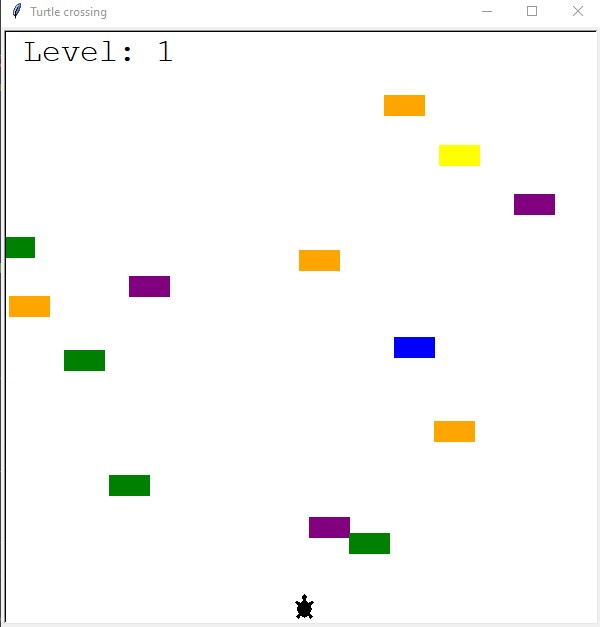

# Turtle Crossing Game

Help the 🐢 to cross the busy road.

## Table of contents

- [Overview](#overview)
  - [The challenge](#the-challenge)
  - [Screenshot](#screenshot)
  - [Links](#links)
- [My process](#my-process)
  - [Built with](#built-with)
  - [What I learned](#what-i-learned)
  - [Continued development](#continued-development)
  - [Useful resources](#useful-resources)
- [Author](#author)
- [Acknowledgments](#acknowledgments)

**Note: Delete this note and update the table of contents based on what sections you keep.**

## Overview

### The challenge

Users should be able to:

- Control the 🐢 using a ↑ key
- Complete the level by successfully getting to other side of the road

### Screenshot

### Links

- Solution URL: [Code](https://github.com/waldekglaz/Turtle-crossing-game)

## My process

### Built with

- Python 3
- Turtle Graphics
